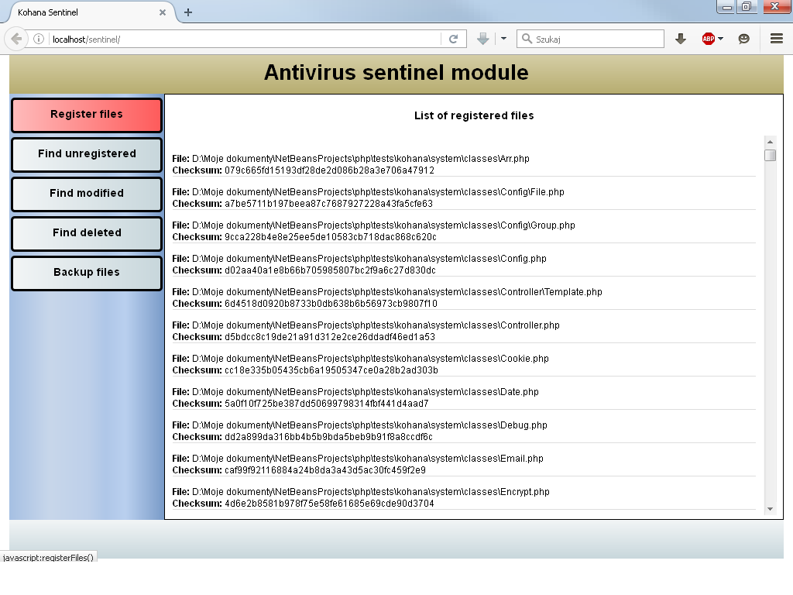
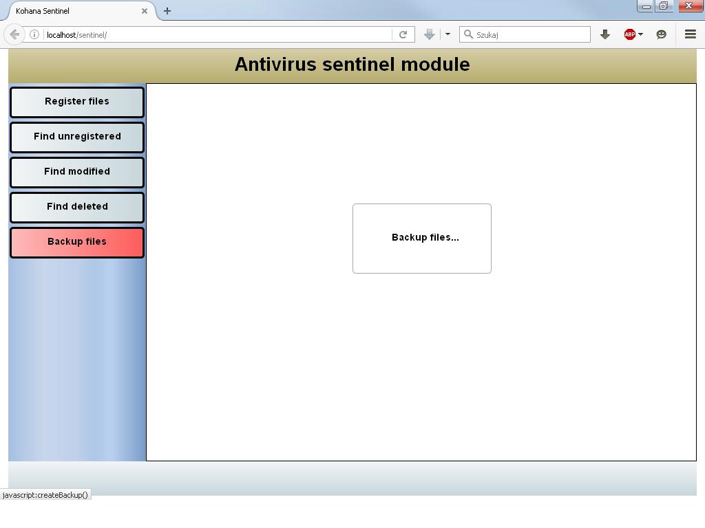
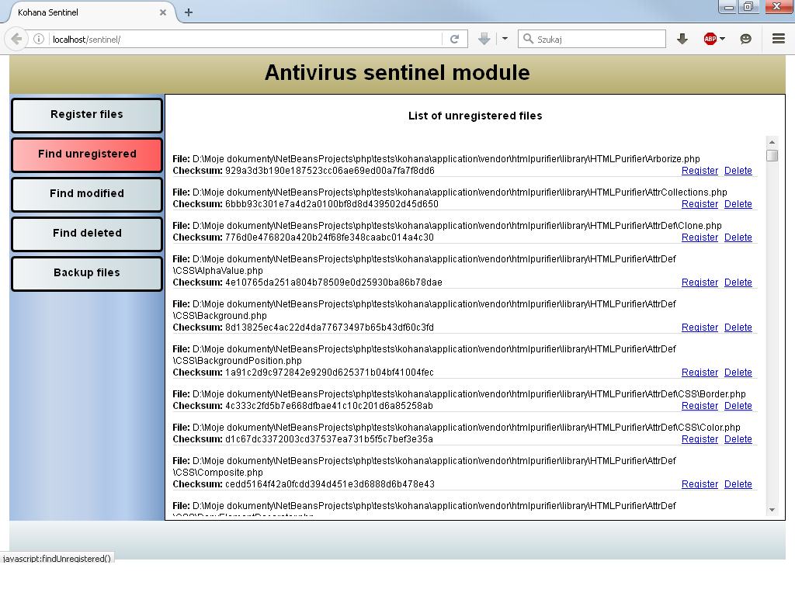
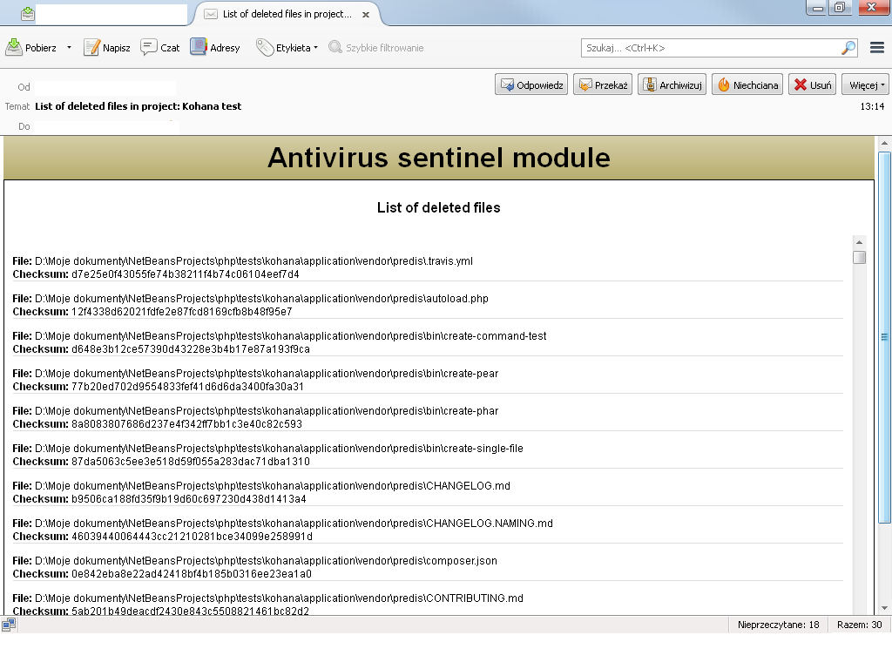

# Kohana Antivirus Sentinel Module

This module can be used to protect your application from potential modification
of PHP scripts for viruses and malware.

## Installation

bootstrap.php:

```php
Kohana::modules(array(
        'sentinel'   => MODPATH . 'sentinel',
	));
```

## Usage

 1. Enter: `http://yoursite.com/sentinel`
 2. First register Your files
 3. Create backup
 4. Later find unregistered (not in list), deleted or modified files
 5. Restore backup
 6. Enjoy :-)

## To do

 1. Automatic scan, backup and restore
 2. Content comparing
 3. Database storage
 4. And more...

## Config


sentinel.php

```php
return array(
    'default' => array(
        'directories' => array(
            'scanned' => array(                //directories to scan
                APPPATH,
                MODPATH,
                SYSPATN,
                // and more if You want
            ),
            'backup' => APPPATH . 'backup',    // store Your backup (not scanned)
            'logs' => APPPATH . 'logs',
            'quarantine' => APPPATH . 'quarantine'
        ),
        'ignored' => array(                    // ignored files and dirs
            'directories' => array(            // must contains full paths
                APPPATH . 'backup',
                APPPATH . 'cache',
                APPPATH . 'logs'
            ),
            'files' => array(                  // only file names, without paths
                '.svn',
                '.git',
                '.gitignore'
            )
        ),
        'compression' => array(               // todo: GZIP, 7-zip, etc...
            'type' => 'zip',
            'include_subfolders' => true,     // not needed
            'params' => array()
        ),
        'inspection' => array(
            'checksum_storage' => array(
                'type' => 'file',
                'directory' => APPPATH . 'inspection',  // store checksum files
            ),
            'self_inspection' => true,
            'on_detection' => Sentinel::NOTHING,
            'caching'      => false,
            'cache_life'   => 1209600,
        ),
        'quarantine' => array(
            'maxlife' => 604800,
            'gc' => 500
        ),
        'autoresponder' => array(
            'driver' => 'email',                        // default driver
            'enabled' => false,
            'project_name' => 'Kohana',
            'email' => array(
                'sender'    => 'sender@domain',        // config your email.php
                'recipient' => 'recipient@domain',
                'mime_type' => 'text/html',
            ),
            'sms' => array(                            // and more...
                'recipient' => 'your phone number',
            ),
        ),
    )
);
```

## Example Screens

#### Do first:



#### Do next:



#### Do later:




#### This may be disabled if You want:



