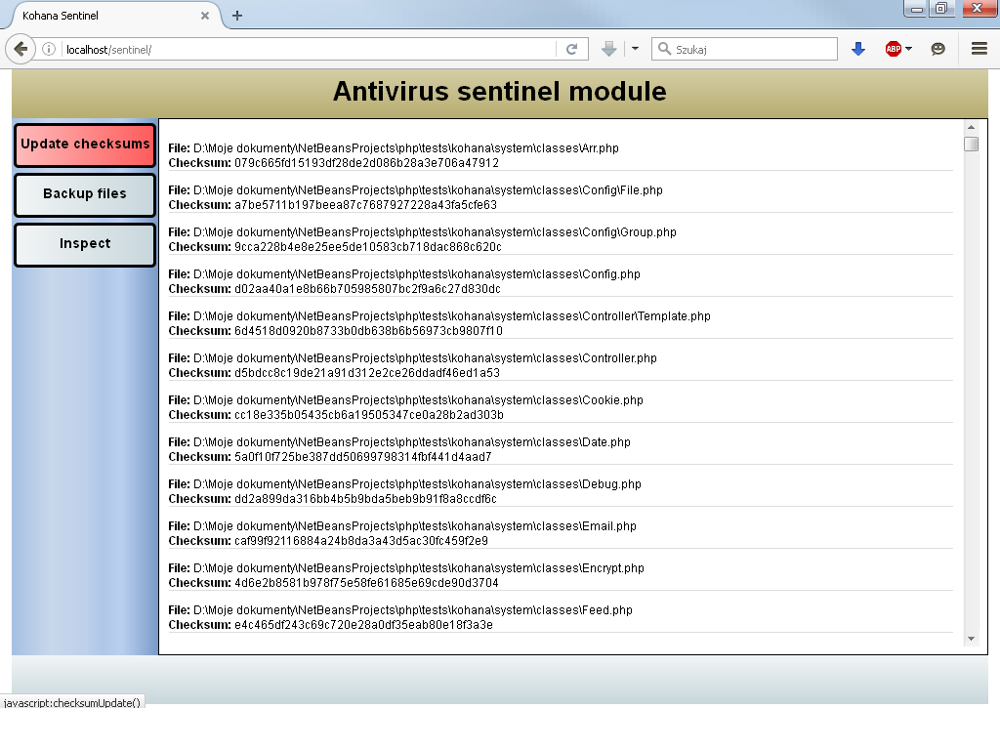
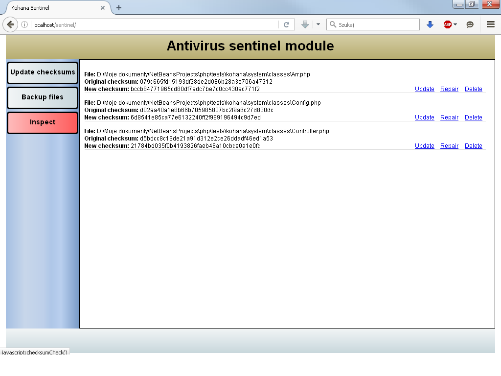

# Kohana Antivirus Sentinel Module

This module can be used to protect your application from potential modification
of PHP scripts for viruses and malware.

## Installation

bootstrap.php:

```php
Kohana::modules(array(
        'sentinel'   => MODPATH . 'sentinel',
	));
```

## Config


sentinel.php

```php
return array(
    'default' => array(
        'directories' => array(
            'scanned' => array(
                APPPATH,
                MODPATH,
                SYSPATH,
            ),
            'backup' => APPPATH . 'backup',
            'logs' => APPPATH . 'logs',
            'quarantine' => APPPATH . 'quarantine'
        ),
        'ignored' => array(
            'directories' => array(
                APPPATH . 'cache',
                APPPATH . 'logs'
            ),
            'files' => array(
                '.svn',
                '.git',
                '.gitignore'
            )
        ),
        'compression' => array(
            'type' => 'zip',
            'include_subfolders' => true,
            'params' => array()
        ),
        'inspection' => array(
            'checksum_storage' => array(
                'type' => 'file',
                'directory' => APPPATH . 'inspection',
            ),
            'self_inspection' => true,
            'on_detection' => Sentinel::NOTHING
        ),
        'quarantine' => array(
            'maxlife' => 604800,
            'gc' => 500
        )
    )
);
```

## Example Screens

#### Update checksums



#### Inspection results with suspicious files


