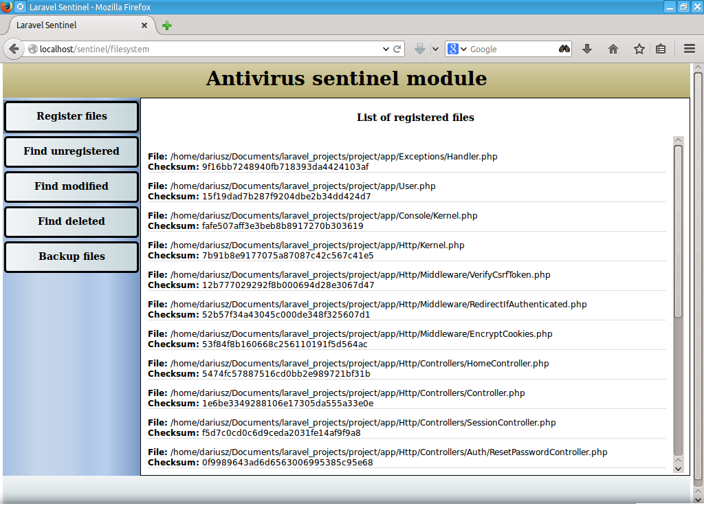

# Kohana Antivirus Sentinel Module

This module can be used to protect your application from potential modification
of PHP scripts for viruses and malware.

## Installation

bootstrap.php:

```php
Kohana::modules(array(
        'sentinel'   => MODPATH . 'sentinel',
	));
```

## Usage

 1. Enter: `http://yoursite.com/sentinel/filesystem`
 2. First register Your files
 3. Create backup
 4. Later find unregistered (not in list), deleted or modified files
 5. Restore backup
 6. Enjoy :-)

## To do

 1. Automatic scan, backup and restore
 2. Content comparing
 3. Database storage
 4. And more...

## Config


sentinel.php

```php
return array(
    'default' => array(
        'filesystem' => array(
            'directories' => array(
                'scanned' => array(
                    APPPATH,
                ),
                'backup' => APPPATH . 'backup',
                'logs' => APPPATH . 'logs',
                'quarantine' => APPPATH . 'quarantine'
            ),
            'ignored' => array(
                'directories' => array(
                    APPPATH . 'cache',
                    APPPATH . 'logs'
                ),
                'files' => array(
                    '.svn',
                    '.git',
                    '.gitignore'
                )
            ),
            'compression' => array(
                'type' => 'zip',
                'include_subfolders' => true,
                'params' => array()
            ),
            'inspection' => array(
                'checksum_storage' => array(
                    'type' => 'file',
                    'directory' => APPPATH . 'inspection',
                ),
                'self_inspection' => true,
                'on_detection' => Sentinel::NOTHING,
                'caching' => false,
                'cache_life' => 1209600,
            ),
            'quarantine' => array(
                'maxlife' => 604800,
                'gc' => 500
            ),
        ),
        'database' => array(

        ),
        'http' => array(

        ),
        'autoresponder' => array(
            'driver' => 'email',
            'enabled' => false,
            'project_name' => 'Kohana',
            'email' => array(
                'sender' => 'sender@domain',
                'recipient' => 'recipient@domain',
                'mime_type' => 'text/html',
            ),
            'sms' => array(
                'recipient' => 'your phone number',
            ),
        ),
    )
);
```

## Example Screens




